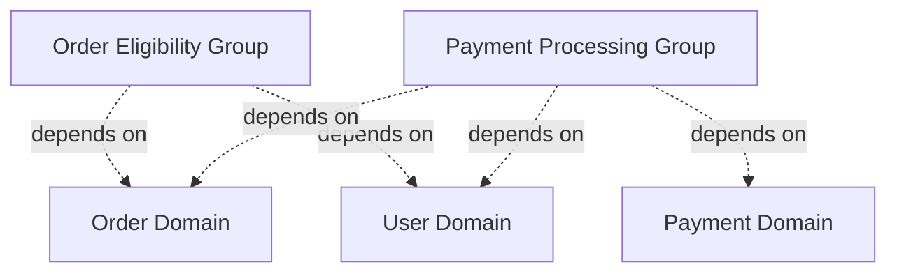
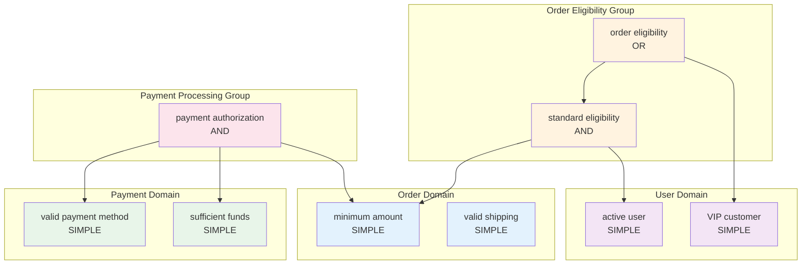

# Documentation Generation Plan

## 1. Overview

### 1.1 Objectives
- Generate human-readable documentation from user-defined rule hierarchies
- Support multiple output formats (Markdown, JSON, HTML)
- Provide both structural and semantic information about rules
- Enable automatic documentation updates as rules evolve
- Support visualization of complex rule hierarchies
- **Support domain-driven design with distributed rule definitions**
- **Enable global rule collection across multiple domain packages**
- **Support domain tagging and cross-domain rule identification**

### 1.2 Use Cases
1. **API Documentation**: Auto-generate rule documentation for API consumers
2. **Business Logic Review**: Enable non-technical stakeholders to review 
   business rules
3. **Compliance Auditing**: Provide audit trails showing rule structure and 
   dependencies
4. **Onboarding**: Help new developers understand complex rule systems
5. **Testing Documentation**: Generate test scenarios from rule structures
6. **Domain-Driven Documentation**: Generate per-domain or cross-domain 
   documentation in applications organized by domain
7. **Multi-Team Coordination**: Document rules across teams owning different 
   domains

## 2. Domain-Driven Architecture

### 2.1 Package Organization

Applications using domain-driven design organize code by domain:

```
myapp/
├── order/
│   ├── model.go
│   ├── store.go
│   ├── service.go
│   └── rules.go          # Order-specific rules
├── user/
│   ├── model.go
│   ├── store.go
│   ├── service.go
│   └── rules.go          # User-specific rules
├── payment/
│   ├── model.go
│   ├── store.go
│   ├── service.go
│   └── rules.go          # Payment-specific rules
└── docs/
    └── generate.go        # Documentation generation
```

### 2.2 Domain Type

Domains are strongly-typed to prevent typos and provide compile-time safety:

```go
// In order/rules.go
package order

import "github.com/tobbstr/rules"

// Define domain as a sentinel value
const OrderDomain = rules.Domain("order")

// Or using a variable for more flexibility
var OrderDomain = rules.Domain("order")
```

**Benefits**:
- Type-safe: Can't accidentally pass wrong string
- Compile-time checking: Typos caught at compile time
- Autocomplete: IDEs can suggest available domains
- Explicit: All domains are declared upfront
- Refactoring-friendly: Easy to rename domains

### 2.3 Rule Registration

**Problem**: Users might forget to register rules, making them invisible to 
documentation generation.

**Solution**: Auto-registration at creation - rules register themselves when 
created, making it impossible to forget:

```go
// In order/rules.go
package order

import "github.com/tobbstr/rules"

// Define domain sentinel value
const OrderDomain = rules.Domain("order")

// Automatically registered at creation
var MinimumAmountRule = rules.NewWithDomain(
    "minimum amount",
    OrderDomain, // Type-safe domain
    func(o Order) (bool, error) {
        return o.Amount >= 100.0, nil
    },
)

// Optional: Add description after creation
var MinimumAmountWithDesc = rules.WithDescription(
    MinimumAmountRule,
    "Order must meet minimum purchase amount",
)

// For cross-domain rules with group names
var OrderEligibilityRule = rules.NewWithGroup(
    "order eligibility",
    "Order Eligibility", // Group name (string)
    []rules.Domain{OrderDomain, user.UserDomain}, // Type-safe domains
    func(r Request) (bool, error) {
        // Rule logic
    },
)
```

**Benefits**:
- Rules register on creation - impossible to forget
- Type-safe domains prevent typos and errors
- Clean, minimal API with focused constructors
- Descriptions added separately for flexibility
- No separate registration step needed
- Documentation always up-to-date

### 2.4 Domain Tagging and Groups

Rules are tagged with domain identifiers and optionally grouped:
- **Single Domain**: Rule belongs to one domain (e.g., `OrderDomain`)
- **Multiple Domains with Group Name**: Rules spanning multiple domains have 
  a meaningful group name (e.g., "Order Eligibility" for order+user)
- **No Domain**: Rule is domain-agnostic (e.g., utility rules)

**Domain vs Group Types**:
- **Domains are typed** (`rules.Domain`): Reused across many rules, benefit 
  from type safety and autocomplete
- **Groups remain strings**: Unique descriptive names per rule, optimized 
  for human readability in documentation headers

Groups provide human-readable names for cross-domain rule collections, 
ensuring documentation headers are meaningful rather than just lists of 
domain names.

### 2.5 Documentation Generation by Domain and Group

Generate documentation filtered by domain or group:

```go
// Generate all rules
allDocs := rules.GenerateMarkdown(rules.AllRules(), opts)

// Generate only Order domain rules
orderDocs := rules.GenerateMarkdown(
    rules.RulesByDomain("order"),
    opts,
)

// Generate by group name (meaningful headers)
eligibilityDocs := rules.GenerateMarkdown(
    rules.RulesByGroup("Order Eligibility"),
    opts,
)

// Generate cross-domain rules (Order + User)
// Groups within these domains will use their group names in headers
crossDocs := rules.GenerateMarkdown(
    rules.RulesByDomains("order", "user"),
    opts,
)
```

## 3. Core Features

### 3.1 Information Extraction
Each rule should expose:
- **Name**: Human-readable identifier
- **Description**: Detailed explanation of the rule's purpose
- **Type**: Simple, AND, OR, NOT, quantifier (AtLeast, Exactly, AtMost)
- **Children**: Nested rules in hierarchical structures
- **Domains**: Domain tags identifying which domain(s) the rule belongs to
- **Group**: Human-readable group name for cross-domain rules
- **Metadata**: Additional information (tags, owner, version, etc.)
- **Examples**: Optional input/output examples
- **Constraints**: Quantifier thresholds (for AtLeast, Exactly, AtMost)

### 3.2 Output Formats

#### 3.2.1 Markdown
- Tree-based hierarchical representation
- Includes rule names, descriptions, and structure
- Easy to read and integrate with existing documentation
- Supports code blocks for examples

#### 3.2.2 JSON
- Machine-readable format
- Enables integration with documentation tools
- Supports querying and programmatic analysis
- Ideal for CI/CD pipelines

#### 3.2.3 HTML
- Interactive visualization with collapsible sections
- Styled for readability
- Supports search and filtering
- Can include diagrams and graphs

#### 3.2.4 Mermaid Diagrams
- Flowchart/graph representation
- Visual hierarchy of rule relationships
- Embeddable in Markdown/HTML

### 3.3 Domain and Group Organization in Output

Documentation can be organized by domain and group:
- Group rules by domain in table of contents
- Use meaningful group names for multi-domain sections
- Separate sections per domain or group
- Highlight cross-domain dependencies
- Filter output to specific domains or groups
- Headers reflect group names instead of domain lists

Example structure:
```
## Order Domain
  ### minimum amount
  ### valid shipping

## User Domain  
  ### active user
  ### VIP customer

## Order Eligibility          ← Meaningful group name
  (Domains: order, user)      ← Domain attribution
  ### order eligibility rule
```

## 4. API Design

### 4.1 Domain Type

```go
// Domain represents a business domain (strongly typed)
type Domain string

// String returns the domain as a string
func (d Domain) String() string

// Common pattern: Define domains as constants in each domain package
// Example in order/rules.go:
const OrderDomain = Domain("order")
```

### 4.2 Auto-Registering Rule Creation

Functions that create rules and automatically register them:

```go
// NewWithDomain creates and registers a rule with a single domain
func NewWithDomain[T any](
    name string,
    domain Domain,
    predicate PredicateFunc[T],
) Rule[T]

// NewWithGroup creates and registers a cross-domain rule with group name
func NewWithGroup[T any](
    name string,
    groupName string,
    domains []Domain,
    predicate PredicateFunc[T],
) Rule[T]

// For rules without domain
func New[T any](name string, predicate PredicateFunc[T]) Rule[T]

// NewWithGroupFromRule wraps an existing rule and registers with group
func NewWithGroupFromRule[T any](
    rule Rule[T],
    groupName string,
    domains []Domain,
) Rule[T]
```

### 4.2.1 Adding Descriptions to Rules

Descriptions are added after rule creation to keep constructors focused:

```go
// WithDescription adds a description to an existing rule
// Returns a wrapped rule with the description
func WithDescription[T any](rule Rule[T], description string) Rule[T]

// UpdateMetadata updates or adds metadata to an already registered rule
func UpdateMetadata(rule any, metadata RuleMetadata) error
```

**Design Rationale**:
- **Separation of concerns**: Rule creation focuses on logic, not documentation
- **Clean API**: Fewer constructor variations to remember
- **Composable**: `WithDescription` can be chained or applied conditionally
- **Optional**: Descriptions only added when needed for documentation

**Usage patterns**:
```go
// Without description (minimal)
var SimpleRule = rules.NewWithDomain("check", OrderDomain, predicate)

// With description (composable)
var DocumentedRule = rules.WithDescription(
    rules.NewWithDomain("check", OrderDomain, predicate),
    "Detailed explanation of what this rule does",
)

// Or assign separately
var MyRule = rules.NewWithDomain("check", OrderDomain, predicate)
var MyDocumentedRule = rules.WithDescription(MyRule, "Description")
```

### 4.3 Registry API

```go
// Registry manages rule registration and retrieval
type Registry interface {
    // Register adds a rule to the registry with domain tags and/or group
    Register(rule any, opts ...RegistrationOption) error
    
    // AllRules returns all registered rules
    AllRules() []RegisteredRule
    
    // RulesByDomain returns rules for a specific domain
    RulesByDomain(domain string) []RegisteredRule
    
    // RulesByDomains returns rules matching any of the specified domains
    RulesByDomains(domains ...string) []RegisteredRule
    
    // RulesByGroup returns rules belonging to a named group
    RulesByGroup(groupName string) []RegisteredRule
    
    // Domains returns all registered domain names
    Domains() []string
    
    // Groups returns all registered group names
    Groups() []string
    
    // Clear removes all registered rules (useful for testing)
    Clear()
}

// RegisteredRule wraps a rule with its registration metadata
type RegisteredRule struct {
    // Rule is the actual rule (type-erased)
    Rule any
    
    // Domains lists which domain(s) this rule belongs to
    Domains []string
    
    // Group is the human-readable group name (optional)
    Group string
    
    // Metadata provides additional rule information
    Metadata *RuleMetadata
    
    // RegisteredAt tracks when the rule was registered
    RegisteredAt time.Time
}

// RegistrationOption configures rule registration
type RegistrationOption func(*registrationConfig)

// Domain tags the rule with a single domain
func Domain(name string) RegistrationOption

// Domains tags the rule with multiple domains (no group name)
func Domains(names ...string) RegistrationOption

// Group tags the rule with a meaningful name and multiple domains
// This is the preferred method for cross-domain rules
func Group(name string, domains ...string) RegistrationOption

// WithMetadata attaches metadata to the rule
func WithMetadata(metadata RuleMetadata) RegistrationOption

// Global registry instance
var DefaultRegistry = NewRegistry()

// Register adds a rule to the default registry
func Register(rule any, opts ...RegistrationOption) error {
    return DefaultRegistry.Register(rule, opts...)
}

// AllRules returns all rules from the default registry
func AllRules() []RegisteredRule {
    return DefaultRegistry.AllRules()
}

// RulesByDomain returns rules for a domain from the default registry
func RulesByDomain(domain string) []RegisteredRule {
    return DefaultRegistry.RulesByDomain(domain)
}

// RulesByDomains returns rules for domains from the default registry
func RulesByDomains(domains ...string) []RegisteredRule {
    return DefaultRegistry.RulesByDomains(domains...)
}

// RulesByGroup returns rules for a group from the default registry
func RulesByGroup(groupName string) []RegisteredRule {
    return DefaultRegistry.RulesByGroup(groupName)
}
```

### 4.4 Core Documenter Interface

```go
// Documenter generates documentation from rules
type Documenter[T any] interface {
    // Generate creates documentation in the specified format
    Generate(rule Rule[T], opts DocumentOptions) ([]byte, error)
    
    // GenerateToFile writes documentation directly to a file
    GenerateToFile(rule Rule[T], filepath string, opts DocumentOptions) error
}

// DocumentOptions configures documentation generation
type DocumentOptions struct {
    // Format specifies the output format
    Format DocumentFormat
    
    // IncludeExamples includes example inputs/outputs if available
    IncludeExamples bool
    
    // MaxDepth limits the depth of rule hierarchy to document
    // (0 = unlimited)
    MaxDepth int
    
    // IncludeMetadata includes additional metadata in output
    IncludeMetadata bool
    
    // Title sets the document title
    Title string
    
    // Description sets the document description
    Description string
    
    // Template allows custom formatting (optional)
    Template string
    
    // GroupByDomain organizes output by domain
    GroupByDomain bool
    
    // IncludeDomains filters to specific domains (empty = all)
    IncludeDomains []string
    
    // ExcludeDomains excludes specific domains
    ExcludeDomains []string
    
    // ShowCrossDomainLinks highlights cross-domain dependencies
    ShowCrossDomainLinks bool
}

// DocumentFormat represents the output format
type DocumentFormat int

const (
    FormatMarkdown DocumentFormat = iota
    FormatJSON
    FormatHTML
    FormatMermaid
)
```

### 4.5 Extended Rule Interface

Add optional documentation-specific methods to rules:

```go
// DocumentableRule extends Rule with documentation capabilities
type DocumentableRule[T any] interface {
    Rule[T]
    
    // Metadata returns additional documentation metadata
    Metadata() RuleMetadata
    
    // Examples returns example inputs and expected outputs
    Examples() []RuleExample[T]
}

// RuleMetadata provides additional rule information
type RuleMetadata struct {
    // Domains identifies which domain(s) this rule belongs to
    // This is typically set via registration, but can be embedded
    Domains []string
    
    // Tags categorize the rule (beyond domain)
    Tags []string
    
    // Owner identifies who maintains the rule
    Owner string
    
    // Version tracks rule version
    Version string
    
    // CreatedAt tracks when the rule was created
    CreatedAt time.Time
    
    // UpdatedAt tracks last modification
    UpdatedAt time.Time
    
    // RelatedRules links to related rules
    RelatedRules []string
    
    // Dependencies lists other domains this rule depends on
    Dependencies []string
}

// RuleExample documents example inputs and outputs
type RuleExample[T any] struct {
    // Name of the example
    Name string
    
    // Input value
    Input T
    
    // Expected result (true/false)
    Expected bool
    
    // Description of the example
    Description string
}
```

### 4.6 Convenience Functions

```go
// NewDocumenter creates a new documenter
func NewDocumenter[T any]() Documenter[T]

// GenerateMarkdown is a convenience function for Markdown generation
func GenerateMarkdown[T any](rule Rule[T], opts DocumentOptions) (string, error)

// GenerateJSON is a convenience function for JSON generation
func GenerateJSON[T any](rule Rule[T], opts DocumentOptions) (string, error)

// GenerateHTML is a convenience function for HTML generation
func GenerateHTML[T any](rule Rule[T], opts DocumentOptions) (string, error)

// GenerateMermaid is a convenience function for Mermaid diagrams
func GenerateMermaid[T any](rule Rule[T], opts DocumentOptions) (string, error)

// Registry-based documentation generation
// GenerateAllRulesMarkdown generates docs for all registered rules
func GenerateAllRulesMarkdown(opts DocumentOptions) (string, error)

// GenerateDomainMarkdown generates docs for a specific domain
func GenerateDomainMarkdown(domain string, opts DocumentOptions) (string, error)

// GenerateDomainsMarkdown generates docs for multiple domains
func GenerateDomainsMarkdown(domains []string, opts DocumentOptions) (string, error)

// GenerateGroupMarkdown generates docs for a specific group
func GenerateGroupMarkdown(groupName string, opts DocumentOptions) (string, error)
```

## 5. Implementation Strategy

### 5.1 Phase 1: Registry & Core Infrastructure (Week 1)
1. Create `registry.go` with Registry interface and implementation
2. Implement `Register()`, `AllRules()`, `RulesByDomain()`, `RulesByGroup()` 
   functions
3. Add domain and group tagging via `RegistrationOption` pattern
4. Implement `Group()` function for meaningful cross-domain naming
5. **Implement auto-registering rule creation functions**:
   - `NewWithDomain()`, `NewWithGroup()`, etc.
   - Automatically register on creation
6. Create `documenter.go` with base interfaces
7. Implement rule introspection (extract structure, children, type, domains, 
   groups)
8. Add `Metadata()` and `Examples()` methods as optional interfaces
9. Create internal representation of rule hierarchy with domain and group info
10. Write comprehensive tests for registry (including group operations and 
    auto-registration)

### 5.2 Phase 2: Markdown Generator (Week 1-2)
1. Implement tree-based Markdown generation
2. Support indentation for hierarchy
3. Add domain grouping and filtering
4. Use group names as headers for multi-domain rules
5. Add collapsible sections (using HTML details/summary in Markdown)
6. Include examples, metadata, domain tags, and group names
7. Show cross-domain dependencies with group context
8. Write comprehensive tests (including group name rendering)

### 5.3 Phase 3: JSON Generator (Week 2)
1. Define JSON schema for rule documentation (including domains and groups)
2. Implement JSON serialization
3. Include full metadata, structure, domain, and group information
4. Add JSON Schema validation
5. Support domain and group filtering in output
6. Write comprehensive tests

### 5.4 Phase 4: HTML Generator (Week 3)
1. Create HTML template system
2. Implement interactive UI with JavaScript
3. Add search/filter capabilities (including by domain and group)
4. Add domain and group navigation/sidebar
5. Use group names in section headers
6. Visualize cross-domain relationships with group context
7. Style with CSS (responsive design)
8. Write comprehensive tests

### 5.5 Phase 5: Mermaid Generator (Week 3-4)
1. Implement Mermaid diagram generation
2. Support flowchart and graph representations
3. Color-code or group by domain
4. Label cross-domain subgraphs with group names
5. Show cross-domain edges
6. Handle complex hierarchies
7. Write comprehensive tests

### 5.6 Phase 6: Polish & Documentation (Week 4)
1. Add comprehensive package documentation
2. Create examples for each format with multi-domain scenarios
3. Document domain-driven architecture patterns
4. Update README with documentation generation section
5. Add integration tests with multi-package scenarios
6. Performance optimization
7. Create best practices guide for domain organization

## 6. Detailed Design

### 6.1 Markdown Output Example (Domain and Group-Based)

```markdown
# Business Rules Documentation

Generated: 2024-10-18 15:30:00

## Table of Contents
- [Order Domain](#order-domain)
- [User Domain](#user-domain)
- [Order Eligibility](#order-eligibility) ← Human-readable group name
- [Payment Processing](#payment-processing) ← Another group

---

## Order Domain

Rules related to order processing and validation.

### minimum amount (SIMPLE)
Order total must be at least $100

**Domain**: order  
**Type**: Simple  
**Owner**: order-team  
**Version**: 1.2.0

**Description**: Validates that order meets minimum purchase requirement

**Condition**: `order.TotalAmount >= 100.0`

---

### valid shipping address (SIMPLE)
Order must have valid shipping address

**Domain**: order  
**Type**: Simple  
**Owner**: order-team

---

## User Domain

Rules related to user validation and permissions.

### active user (SIMPLE)
User account must be active

**Domain**: user  
**Type**: Simple  
**Owner**: user-team  
**Version**: 2.0.0

**Description**: Checks if user account status is active

---

### verified email (SIMPLE)
User must have verified email address

**Domain**: user  
**Type**: Simple  
**Owner**: user-team

---

## Order Eligibility

Rules for determining if an order can be placed.

**Group**: Order Eligibility  
**Domains**: order, user  
**Owner**: platform-team

### order eligibility (OR)
Order can be placed if any condition is met

**Type**: OR

At least one of these conditions must be satisfied:

#### VIP customer (SIMPLE)
Check if customer has VIP status

**Domain**: user  
**Type**: Simple

#### standard eligibility (AND)
Standard order requirements

**Domains**: order, user  
**Type**: AND

All of these conditions must be satisfied:

##### minimum amount (SIMPLE)
*See Order Domain*

##### active user (SIMPLE)
*See User Domain*

---

## Payment Processing

Rules for payment validation and processing.

**Group**: Payment Processing  
**Domains**: payment, order, user  
**Owner**: payments-team

### payment authorization (AND)
All payment requirements must be met

**Type**: AND

All of these conditions must be satisfied:

#### valid payment method (SIMPLE)
Payment method must be valid and not expired

**Domain**: payment

#### sufficient funds (SIMPLE)
Account must have sufficient funds

**Domain**: payment

#### order total matches (SIMPLE)
Payment amount matches order total

**Domain**: order

---

## Domain Dependency Graph



---

## Examples

### Example 1: VIP Customer
**Domains**: order, user  
**Input**: 
```json
{
  "order": {"TotalAmount": 50.0},
  "user": {"IsVIP": true, "Status": "active"}
}
```
**Result**: ✓ Satisfied (VIP bypass)

### Example 2: Standard Customer
**Domains**: order, user  
**Input**:
```json
{
  "order": {"TotalAmount": 150.0},
  "user": {"IsVIP": false, "Status": "active"}
}
```
**Result**: ✓ Satisfied (meets standard requirements)
```

### 6.2 JSON Output Schema

```json
{
  "$schema": "http://json-schema.org/draft-07/schema#",
  "title": "Rule Documentation",
  "type": "object",
  "properties": {
    "name": {
      "type": "string",
      "description": "Rule name"
    },
    "description": {
      "type": "string",
      "description": "Rule description"
    },
    "type": {
      "type": "string",
      "enum": ["simple", "and", "or", "not", "atLeast", "exactly", "atMost"]
    },
    "domains": {
      "type": "array",
      "items": { "type": "string" },
      "description": "Domain(s) this rule belongs to"
    },
    "group": {
      "type": "string",
      "description": "Human-readable group name for multi-domain rules"
    },
    "metadata": {
      "type": "object",
      "properties": {
        "tags": { "type": "array", "items": { "type": "string" } },
        "owner": { "type": "string" },
        "version": { "type": "string" },
        "createdAt": { "type": "string", "format": "date-time" },
        "updatedAt": { "type": "string", "format": "date-time" },
        "dependencies": {
          "type": "array",
          "items": { "type": "string" },
          "description": "Other domains this rule depends on"
        }
      }
    },
    "children": {
      "type": "array",
      "items": { "$ref": "#" }
    },
    "examples": {
      "type": "array",
      "items": {
        "type": "object",
        "properties": {
          "name": { "type": "string" },
          "description": { "type": "string" },
          "expected": { "type": "boolean" },
          "domains": {
            "type": "array",
            "items": { "type": "string" }
          }
        }
      }
    },
    "constraints": {
      "type": "object",
      "properties": {
        "threshold": { "type": "integer" }
      }
    }
  },
  "required": ["name", "type"]
}
```

### 6.3 HTML Output Features

- **Interactive Tree**: Expandable/collapsible rule hierarchy
- **Domain Navigation**: Sidebar with domain-based filtering
- **Search**: Filter rules by name, tag, domain, or description
- **Domain Tags**: Visual badges showing domain associations
- **Cross-Domain Links**: Clickable links to related domains
- **Syntax Highlighting**: For code examples
- **Responsive Design**: Mobile-friendly layout
- **Dark Mode**: Toggle between light/dark themes
- **Export**: Download as PDF or print
- **Navigation**: Table of contents with anchor links and domain sections

### 6.4 Mermaid Diagram Example (with Domains and Groups)



## 7. Rule Introspection

### 7.1 Type Detection

Implement internal methods to detect rule types:

```go
// Internal introspection helpers
func getRuleType[T any](rule Rule[T]) RuleType {
    switch rule.(type) {
    case *andRule[T]:
        return RuleTypeAnd
    case *orRule[T]:
        return RuleTypeOr
    case *notRule[T]:
        return RuleTypeNot
    case *simpleRule[T]:
        return RuleTypeSimple
    default:
        return RuleTypeUnknown
    }
}

func getChildren[T any](rule Rule[T]) []Rule[T] {
    switch r := rule.(type) {
    case *andRule[T]:
        return r.rules
    case *orRule[T]:
        return r.rules
    case *notRule[T]:
        return []Rule[T]{r.rule}
    default:
        return nil
    }
}
```

### 7.2 Traversal Strategy

Use depth-first traversal for rule hierarchies:

```go
type ruleNode[T any] struct {
    Rule     Rule[T]
    Type     RuleType
    Children []*ruleNode[T]
    Depth    int
}

func buildRuleTree[T any](rule Rule[T], depth int, maxDepth int) *ruleNode[T] {
    if maxDepth > 0 && depth > maxDepth {
        return nil
    }
    
    node := &ruleNode[T]{
        Rule:  rule,
        Type:  getRuleType(rule),
        Depth: depth,
    }
    
    children := getChildren(rule)
    for _, child := range children {
        if childNode := buildRuleTree(child, depth+1, maxDepth); childNode != nil {
            node.Children = append(node.Children, childNode)
        }
    }
    
    return node
}
```

## 8. Testing Strategy

### 8.1 Unit Tests
- Test each format generator independently
- Test with various rule hierarchies (simple, nested, deep)
- Test edge cases (empty rules, nil rules, circular references)
- Test options (max depth, include examples, metadata)

### 8.2 Integration Tests
- Test end-to-end documentation generation
- Test with real-world rule examples from multiple domains
- Test domain filtering and grouping
- Compare generated output against golden files
- Test cross-format consistency
- Test multi-package rule registration

### 8.3 Example Tests
```go
func TestMarkdownGenerator(t *testing.T) {
    tests := []struct {
        name     string
        rule     Rule[Order]
        opts     DocumentOptions
        wantFile string
    }{
        {
            name: "simple rule",
            rule: New("minimum amount", func(o Order) (bool, error) {
                return o.Amount >= 100, nil
            }),
            opts: DocumentOptions{Format: FormatMarkdown},
            wantFile: "testdata/simple_rule.md",
        },
        {
            name: "hierarchical rule",
            rule: And("eligibility",
                New("minimum amount", ...),
                New("valid country", ...),
            ),
            opts: DocumentOptions{Format: FormatMarkdown},
            wantFile: "testdata/hierarchical_rule.md",
        },
    }
    
    for _, tt := range tests {
        t.Run(tt.name, func(t *testing.T) {
            documenter := NewDocumenter[Order]()
            got, err := documenter.Generate(tt.rule, tt.opts)
            if err != nil {
                t.Fatalf("Generate() error = %v", err)
            }
            
            want, err := os.ReadFile(tt.wantFile)
            if err != nil {
                t.Fatalf("ReadFile() error = %v", err)
            }
            
            if !bytes.Equal(got, want) {
                t.Errorf("Generate() mismatch:\ngot:\n%s\nwant:\n%s", 
                    got, want)
            }
        })
    }
}
```

### 8.4 Benchmark Tests
```go
func BenchmarkMarkdownGenerator(b *testing.B) {
    rule := createLargeRuleHierarchy() // 1000+ rules
    documenter := NewDocumenter[Order]()
    opts := DocumentOptions{Format: FormatMarkdown}
    
    b.ResetTimer()
    for i := 0; i < b.N; i++ {
        _, _ = documenter.Generate(rule, opts)
    }
}
```

## 9. File Organization

### 9.1 New Files
```
rules/
├── registry.go              # Rule registry implementation
├── registry_test.go         # Registry tests
├── documenter.go            # Core interface and types
├── documenter_markdown.go   # Markdown generator
├── documenter_json.go       # JSON generator
├── documenter_html.go       # HTML generator
├── documenter_mermaid.go    # Mermaid generator
├── documenter_test.go       # Tests
├── documenter_example_test.go  # Example tests
└── testdata/
    ├── simple_rule.md
    ├── hierarchical_rule.md
    ├── domain_grouped.md
    ├── cross_domain.md
    ├── simple_rule.json
    ├── hierarchical_rule.json
    ├── simple_rule.html
    └── hierarchical_rule.html
```

### 9.2 Updated Files
- `rule.go`: Add `WithDescription()` function and optional `DocumentableRule` interface
- `README.md`: Add documentation generation section and registry usage
- `EXAMPLES.md`: Add documentation generation examples with multi-domain scenarios

## 10. Optional Enhancements

Users can optionally enhance rules with documentation metadata:

```go
// Basic rule
basicRule := rules.New("check amount", func(o Order) (bool, error) {
    return o.Amount >= 100, nil
})

// Rule with description
documentedRule := rules.WithDescription(basicRule, "Order must meet minimum amount")

// Rule with full metadata
func init() {
    rules.UpdateMetadata(documentedRule, rules.RuleMetadata{
        Owner:   "order-team",
        Version: "1.0.0",
        Tags:    []string{"validation"},
    })
}
```

## 11. Usage Examples

### 11.1 Multi-Domain Setup (Auto-Registration)

```go
// In order/rules.go
package order

import "github.com/tobbstr/rules"

// Define domain constant (type-safe)
const OrderDomain = rules.Domain("order")

type Order struct {
    Amount  float64
    Country string
}

// Rules auto-register on creation - no separate registration needed!
var (
    MinimumAmountRule = rules.WithDescription(
        rules.NewWithDomain(
            "minimum amount",
            OrderDomain, // Type-safe domain
            func(o Order) (bool, error) {
                return o.Amount >= 100.0, nil
            },
        ),
        "Order must meet minimum purchase amount",
    )
    
    ValidCountryRule = rules.NewWithDomain(
        "valid country",
        OrderDomain, // Type-safe domain
        func(o Order) (bool, error) {
            return o.Country == "US" || o.Country == "CA", nil
        },
    )
)

// Optional: Add metadata after creation if needed
func init() {
    // Metadata can be added to auto-registered rules
    rules.UpdateMetadata(MinimumAmountRule, rules.RuleMetadata{
        Owner:   "order-team",
        Version: "1.2.0",
        Tags:    []string{"validation", "financial"},
    })
}

// In user/rules.go
package user

import "github.com/tobbstr/rules"

// Define domain constant (type-safe)
const UserDomain = rules.Domain("user")

type User struct {
    IsVIP  bool
    Status string
}

// Auto-registered rules
var (
    VIPCustomerRule = rules.NewWithDomain(
        "VIP customer",
        UserDomain, // Type-safe domain
        func(u User) (bool, error) {
            return u.IsVIP, nil
        },
    )
    
    ActiveUserRule = rules.NewWithDomain(
        "active user",
        UserDomain, // Type-safe domain
        func(u User) (bool, error) {
            return u.Status == "active", nil
        },
    )
)

// In eligibility/rules.go (cross-domain with auto-registration)
package eligibility

import (
    "github.com/tobbstr/rules"
    "myapp/order"
    "myapp/user"
)

type Request struct {
    Order order.Order
    User  user.User
}

// Define the rule logic
var orderEligibilityLogic = rules.Or(
    "order eligibility",
    rules.Map("VIP bypass", user.VIPCustomerRule, 
        func(r Request) user.User { return r.User }),
    rules.And("standard eligibility",
        rules.Map("min amount", order.MinimumAmountRule,
            func(r Request) order.Order { return r.Order }),
        rules.Map("active", user.ActiveUserRule,
            func(r Request) user.User { return r.User }),
    ),
)

// Auto-register with group name - impossible to forget!
var OrderEligibilityRule = rules.NewWithGroupFromRule(
    orderEligibilityLogic,
    "Order Eligibility", // Human-readable group name
    []rules.Domain{order.OrderDomain, user.UserDomain}, // Type-safe domains
)

// Optional: Add metadata
func init() {
    rules.UpdateMetadata(OrderEligibilityRule, rules.RuleMetadata{
        Owner:        "platform-team",
        Version:      "2.0.0",
        Tags:         []string{"eligibility", "business-logic"},
        Dependencies: []string{"order", "user"},
    })
}
```

### 11.2 Generating Documentation

```go
// In docs/generate.go
package main

import (
    "log"
    "os"
    
    "github.com/tobbstr/rules"
    // Import packages to trigger init() registration
    _ "myapp/order"
    _ "myapp/user"
    _ "myapp/eligibility"
)

func main() {
    // Generate documentation for all registered rules
    allDocs, err := rules.GenerateAllRulesMarkdown(rules.DocumentOptions{
        Title:              "Business Rules Documentation",
        Description:        "Complete business rules across all domains",
        Format:             rules.FormatMarkdown,
        IncludeExamples:    true,
        IncludeMetadata:    true,
        GroupByDomain:      true,
        ShowCrossDomainLinks: true,
    })
    if err != nil {
        log.Fatal(err)
    }
    
    // Write combined documentation
    if err := os.WriteFile("docs/all-rules.md", []byte(allDocs), 0644); err != nil {
        log.Fatal(err)
    }
    
    // Generate domain-specific documentation
    orderDocs, err := rules.GenerateDomainMarkdown("order", 
        rules.DocumentOptions{
            Title:           "Order Domain Rules",
            Format:          rules.FormatMarkdown,
            IncludeMetadata: true,
        },
    )
    if err != nil {
        log.Fatal(err)
    }
    
    if err := os.WriteFile("docs/order-rules.md", []byte(orderDocs), 0644); err != nil {
        log.Fatal(err)
    }
    
    // Generate JSON for CI/CD validation
    jsonDocs, err := rules.GenerateAllRulesMarkdown(rules.DocumentOptions{
        Format:          rules.FormatJSON,
        IncludeMetadata: true,
        IncludeExamples: true,
    })
    if err != nil {
        log.Fatal(err)
    }
    
    if err := os.WriteFile("docs/rules.json", []byte(jsonDocs), 0644); err != nil {
        log.Fatal(err)
    }
    
    log.Println("Documentation generated successfully!")
}
```

### 11.3 Filtering and Querying

```go
// Get all registered domains
domains := rules.DefaultRegistry.Domains()
fmt.Printf("Available domains: %v\n", domains)
// Output: Available domains: [order user payment]

// Get all registered groups
groups := rules.DefaultRegistry.Groups()
fmt.Printf("Available groups: %v\n", groups)
// Output: Available groups: [Order Eligibility Payment Processing]

// Get all rules for a specific domain
orderRules := rules.RulesByDomain("order")
fmt.Printf("Order domain has %d rules\n", len(orderRules))

// Get rules by group name (human-readable!)
eligibilityRules := rules.RulesByGroup("Order Eligibility")
fmt.Printf("Order Eligibility group has %d rules\n", len(eligibilityRules))

// Get rules spanning multiple domains (cross-domain rules)
crossDomainRules := rules.RulesByDomains("order", "user")
fmt.Printf("Found %d rules spanning order and user domains\n", 
    len(crossDomainRules))

// Get all rules
allRules := rules.AllRules()
for _, r := range allRules {
    fmt.Printf("Rule: %v, Group: %s, Domains: %v\n", 
        r.Rule, r.Group, r.Domains)
}

// Generate documentation for a specific group
groupDocs, err := rules.GenerateGroupMarkdown("Order Eligibility", 
    rules.DocumentOptions{
        Title:           "Order Eligibility Rules",
        Format:          rules.FormatMarkdown,
        IncludeMetadata: true,
    },
)

// Generate documentation with domain filtering
opts := rules.DocumentOptions{
    Format:         rules.FormatMarkdown,
    IncludeDomains: []string{"order", "user"}, // Only these domains
    ExcludeDomains: []string{"internal"},       // Exclude internal rules
    GroupByDomain:  true,
}

docs, err := rules.GenerateAllRulesMarkdown(opts)
```

### 11.4 CI/CD Integration

```go
// In a test file
func TestRuleDocumentation(t *testing.T) {
    // Ensure all expected domains are registered
    domains := rules.DefaultRegistry.Domains()
    expectedDomains := []string{"order", "user", "payment"}
    for _, expected := range expectedDomains {
        assert.Contains(t, domains, expected, 
            "Domain %s should be registered", expected)
    }
    
    // Generate documentation for all rules
    doc, err := rules.GenerateAllRulesMarkdown(rules.DocumentOptions{
        Format: rules.FormatJSON,
    })
    require.NoError(t, err)
    
    // Validate against schema
    err = validateJSONSchema(doc, ruleSchemaPath)
    require.NoError(t, err)
    
    // Write to docs directory
    err = os.WriteFile("docs/rules.json", []byte(doc), 0644)
    require.NoError(t, err)
    
    // Verify each domain has at least one rule
    for _, domain := range expectedDomains {
        domainRules := rules.RulesByDomain(domain)
        assert.NotEmpty(t, domainRules,
            "Domain %s should have at least one rule", domain)
    }
}
```

## 12. Future Enhancements

### 12.1 Phase 2 Features
- **GraphQL API**: Query rule documentation programmatically
- **OpenAPI Integration**: Generate OpenAPI specs from rules
- **Version Comparison**: Diff between rule versions
- **Impact Analysis**: Show what changes when a rule is modified
- **Test Generation**: Auto-generate test cases from rules
- **Domain Visualization**: Interactive graphs showing domain relationships
- **Coverage Reports**: Show which domains have comprehensive rules

### 12.2 Phase 3 Features
- **Visual Editor**: Web-based rule editor with live preview
- **Rule Linting**: Validate rules against best practices
- **Performance Metrics**: Show evaluation performance in docs
- **A/B Testing**: Document rule variants and experiments
- **Localization**: Multi-language documentation support
- **Domain Metrics**: Statistics per domain (rule count, complexity, etc.)

### 12.3 Integration Ideas
- **Swagger/OpenAPI**: Embed rules in API documentation
- **Confluence**: Push documentation to Confluence
- **GitHub Pages**: Auto-publish to GitHub Pages with domain navigation
- **DocuSign**: Integrate with contract management
- **JIRA**: Link rules to user stories/tickets per domain
- **Microservices**: Export per-domain documentation for service boundaries

## 13. Open Questions

1. **Group Type**: Should Group also be a typed value like Domain?
   - **Pros**: Consistency with Domain, type safety, autocomplete
   - **Cons**: Groups are unique descriptive strings, less reused than domains
   - **Current decision**: Groups remain strings for flexibility and readability
   - **Reconsider if**: Users start reusing group names across packages

2. **Hierarchical Rules**: How to handle And, Or, Not with auto-registration?
   - Should composed rules inherit parent's domain/group?
   - Manual registration for hierarchical rules?
   - Special constructors like `AndWithDomain()`?

3. **Domain Naming**: Best practices for domain names?
   - Enforce lowercase? (e.g., `Domain("order")` vs `Domain("Order")`)
   - Singular vs plural? (e.g., `Domain("order")` vs `Domain("orders")`)
   - Hyphenated? (e.g., `Domain("order-management")`)
   - Subdomains? (e.g., `Domain("order.shipping")`)
   - Recommend naming convention in docs?

4. **Registry Initialization**: How to ensure all domains are loaded?
   - Auto-registration happens when variables are initialized
   - What about lazy loading or conditional rules?

5. **Cross-Domain Dependencies**: How to validate dependencies?
   - Should we detect circular dependencies?
   - Auto-discover dependencies from rule structure?

6. **Predicate Visualization**: How to document the actual predicate logic 
   without exposing implementation details?
   - Option A: Use comments/descriptions only
   - Option B: Allow optional source code inclusion
   - Option C: Support pseudo-code representation

7. **Cross-Type Rules**: How to document rules that operate on different 
   types via `Map()`?
   - Show type transformations?
   - Document extractor functions?
   - Indicate domain of the extracted type?

8. **Dynamic Rules**: How to handle rules built at runtime?
   - Snapshot at documentation generation time?
   - Mark as "dynamic" in output?

9. **Large Hierarchies**: How to handle extremely deep/wide rule trees?
   - Pagination in HTML?
   - Summary views with expand-on-demand?
   - Domain-level and group-level summaries?

10. **Security**: Should sensitive rule logic be redactable?
    - Add `Sensitive bool` flag to metadata?
    - Support redaction templates?
    - Per-domain or per-group sensitivity settings?

11. **Domain Ownership**: How to handle overlapping ownership?
    - Can multiple teams own the same domain?
    - Can a group have a different owner than its constituent domains?
    - How to track contributors per domain and per group?

## 14. Success Metrics

### 14.1 Technical Metrics
- 100% test coverage on public APIs (including registry)
- All tests pass on Go 1.19+
- Documentation generation < 100ms for typical hierarchies (< 50 rules)
- Memory usage < 10MB for hierarchies up to 1000 rules
- Registry operations are thread-safe and performant
- Domain filtering adds < 10ms overhead
- Auto-registration adds negligible overhead (< 1µs per rule)

### 14.2 User Experience Metrics
- Generated documentation is human-readable without training
- Non-developers can understand business logic from docs
- Domain organization is intuitive
- Cross-domain dependencies are clear
- **Forgotten registrations are impossible** (via auto-registration)
- Generated docs pass accessibility standards (WCAG 2.1 AA)

### 14.3 Adoption Metrics
- Clear examples for all major use cases
- Domain-driven examples resonate with users
- Integration guides for common tools (CI/CD, wikis, etc.)
- Positive community feedback
- Adoption by projects using domain-driven design

## 15. Timeline

### Week 1
- Design review and API finalization (including domain/registry design)
- Registry implementation (thread-safe, domain filtering)
- Core documenter infrastructure
- Markdown generator (MVP with domain support)
- Tests for registry

### Week 2
- JSON generator with domain metadata
- Enhanced metadata support (domains, dependencies)
- Domain filtering and grouping in generators
- Initial tests and multi-domain examples

### Week 3
- HTML generator with domain navigation
- Mermaid generator with domain subgraphs
- Advanced features (cross-domain links, dependency detection)
- Integration tests with multi-package scenarios

### Week 4
- Polish and documentation
- Domain-driven examples and best practices guide
- README and EXAMPLES.md updates
- Multi-domain integration tests
- Performance optimization
- Release preparation

## 16. Dependencies

### 16.1 External Dependencies (if any)
- Consider using existing libraries for:
  - HTML templating: `html/template` (stdlib)
  - JSON handling: `encoding/json` (stdlib)
  - Markdown: Custom implementation (no external deps)
  - Mermaid: String generation (no external deps)
  - Thread-safety: `sync.RWMutex` (stdlib) for registry

### 16.2 Internal Dependencies
- Extend existing Rule interface (backward compatible)
- Use existing evaluator for validation
- Leverage existing error handling patterns
- New registry package with minimal coupling to existing code

## 17. Risks & Mitigation

### 17.1 Risk: Breaking Changes
**Mitigation**: All changes are additive; use optional interfaces; registry is opt-in

### 17.2 Risk: Performance Overhead
**Mitigation**: Documentation generation is opt-in and not in hot path; registry uses RWMutex for concurrent reads

### 17.3 Risk: Complex Hierarchies
**Mitigation**: Implement max depth limits and pagination; domain grouping for better organization

### 17.4 Risk: Type Safety with Generics
**Mitigation**: Use type-safe APIs; limit reflection where possible; type-erase at registry boundary only

### 17.5 Risk: Format Changes
**Mitigation**: Version output format; support multiple versions

### 17.6 Risk: Domain Conflicts
**Mitigation**: Allow duplicate domain names; use metadata to distinguish; provide warnings in docs

### 17.7 Risk: Init Order Dependencies
**Mitigation**: Document best practices; support explicit registration; provide loader helper

### 17.8 Risk: Global Registry State
**Mitigation**: Support custom registries; provide Clear() for testing; document thread-safety guarantees

## 18. Documentation Requirements

### 18.1 Package Documentation
- Overview of documentation generation feature
- Overview of registry and domain-driven patterns
- Quick start guide with multi-domain example
- API reference for all public types and functions
- Best practices for domain organization

### 18.2 Examples
- At least one example per output format
- Multi-domain setup example
- Cross-domain rule example
- Real-world use case examples
- CI/CD integration example with domain validation

### 18.3 Best Practices Guide
- How to organize rules by domain
- Domain naming conventions
- When to use groups vs single domains
- Performance considerations
- Registry initialization patterns

## 19. Review Checklist

- [ ] API is idiomatic Go
- [ ] All public APIs have documentation comments
- [ ] Registry implementation is thread-safe
- [ ] 100% test coverage on public APIs (including registry and groups)
- [ ] Examples compile and run
- [ ] Multi-domain examples use meaningful group names
- [ ] **Auto-registration functions work correctly** (`NewWithDomain`, `NewWithGroup`)
- [ ] **Auto-registration makes forgotten rules impossible**
- [ ] Group-based querying works correctly
- [ ] Documentation headers use group names (not domain lists)
- [ ] README updated with:
  - Auto-registration approach
  - Domain-driven patterns and groups
  - Best practices for domain organization
- [ ] API is clean and focused (minimal constructor variations)
- [ ] `WithDescription()` works correctly for adding descriptions
- [ ] Code passes golangci-lint
- [ ] Performance benchmarks included (registry, groups, auto-registration)
- [ ] Error handling follows project conventions
- [ ] Domain filtering works correctly
- [ ] Group filtering works correctly
- [ ] Cross-domain dependencies are documented with group context
- [ ] Generated docs have human-readable headers
- [ ] Works with Go 1.19+

